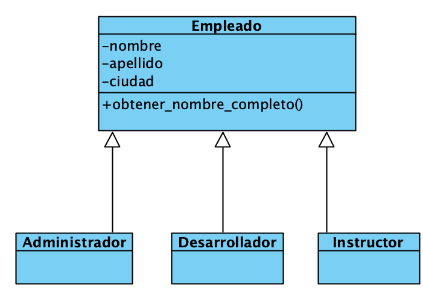

## Introducción a Clases en Python


```python

class Docente:

    # Constructor de la clase
    def __init__(self, codigo, nombre, apellido, edad):
        self.codigo = codigo
        self.nombre = nombre
        self.apellido = apellido
        self.edad = edad


    def obtener_info(self):
        ret = f'Código: {self.codigo}, Nombre: {self.nombre} {self.apellido}, Edad: {self.edad}'
        return ret
    
    def obtener_login(self):
        ret = self.nombre[0].lower() + self.apellido.lower()
        return ret


doc_jaime = Docente(1, 'Jaime', 'García', 30) # Se instancia una clase
doc_gerardo = Docente(2, 'Gerardo', 'Martínez', 25) # Se instancia una clase
doc_enrique = Docente(3, 'Enrique', 'López', 35) # Se instancia una clase

print(doc_jaime.obtener_info())
print(doc_jaime.obtener_login())
```


### Ejercicio Propuesto de clases

- Crear la clase InstitutoEducativo que tengas los atributos
codigo, nombre, ubicacion, descripcion, anho_fundacion, ruc
- Debe tener los metodos : obtener_ruc , obtener_info
- Usarlo para crear 3 objetos de institutos


## Introducción a Herencias en Python




```python


# Clase Base
class Empleado:

    def __init__(self, nombre, apellido, ciudad):
        self.nombre = nombre
        self.apellido = apellido
        self.ciudad = ciudad

    def obtener_nombre_completo(self):
        return self.nombre + " " + self.apellido
    

# Clase hijas

class Administrador(Empleado):
    pass

class Desarrollador(Empleado):
    pass

class Instructor(Empleado):
    pass


admin = Administrador("Juan","Sanchez","Lima")

des = Desarrollador("Jaime","Gomez","Trujillo")

instructor = Instructor("Maria","Perez","Arequipa")


print(admin.obtener_nombre_completo())
print(des.obtener_nombre_completo())
print(instructor.obtener_nombre_completo())
```


## Ejemplo de una tabla
|Titulo|Descripcion|Observacion|
|-|-|-|
|Python|Lenguaje de Programacion|-|
|Java|Lenguaje de Programacion|-|
